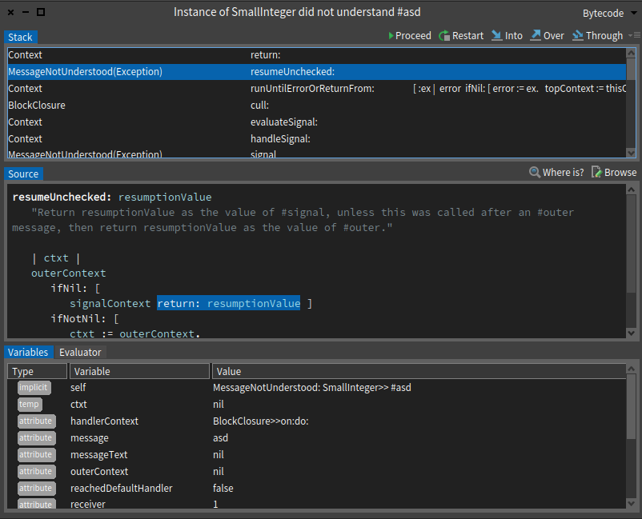

# FailSafeDebugger

A debugger for Pharo 11, but fail-safe :^)

## Why we need this?

Working in anything used by StDebugger initialization means that we lose the ability to debug those changes.
This means:

- No breakpoints.
- No stepping*.
- No inspection*.

(*) possibly available through the Emergency Debugger.

The FailSafeDebugger should offer those features for such scenario.

We would like to debug the ActionModel (and DebugSession) and also being able to debug the StDebugger (the presenter), for example, in case something is not rendered correctly.

We don't want it to be extensible. The idea is to make it as simple, stable and robust as posible. 
It is not expected to change.

## Guidelines

Follow the GT debugger user experience (but simplified).

  

### UI Components:

1. Toolbar: almost copy the one from GT Debugger.
   Restart, Over, Into, Proceed, Through
1. StackTable:
   - We want it:.
   - No Context Menu commands.
   - No filtering.
1. Code Presenter:
   - With highlight (otherwise we don't know what are we executing).
   - Initially, we will use SpPresenter as it comes.
1. Inspector:
   - Failsafe if needed (if it crashes on update or loading, then nothing is shown, but the debugger doesnt break, ever).
   - One mode only (not like the inspector for failing test cases).
   - Initially, have the same as StDebugger (miller-thing). Later No miller presenter(as simple as possible).

### First development milestone:
Make it work programmatically:

FailSafeDebugger debug: `[StDebugger new something]`.

### Layout:
Vertical layout.
Order: Stack, toolbar, code, inspector (like StDebugger).

### Classes
We'll start with the two proposed classes design.

### Coding Guidelines

Add proper class comments.

### Tests

To be discussed

### Final notes

You are free to act and contribute independently as long as you follow the guidelines.
We can change the guidelines if needed after the subject has been discussed with the group.
